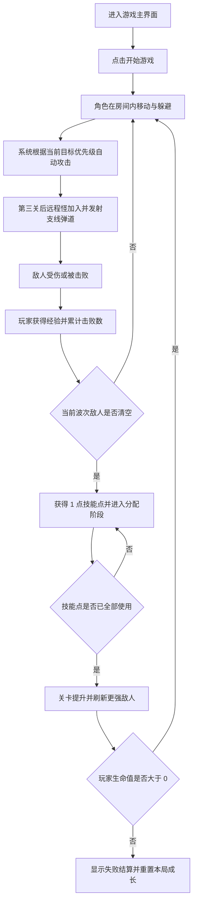

## 1. 产品概述
《像素地牢猎手》是一款桌面优先的单人像素风 roguelike 小游戏，玩家在扩展后的大尺寸地牢房间中持续移动、生存、自动攻击并推进关卡。
- 目标用户为希望快速体验轻量战斗循环的玩家，强调 3 到 5 分钟即可完成一局的爽快感。
- 产品价值在于用较小的功能范围构建一套完整可玩的玩法闭环，为后续扩展职业、道具、地图与敌人类型提供基础。

## 2. 核心功能

### 2.1 功能模块
1. **游戏主界面**：标题区、玩法提示、开始按钮、核心游戏画布、状态栏、结果提示。
2. **战斗场景模块**：玩家移动、敌人刷新、自动攻击、近战/远程敌人区分、受击反馈、拾取经验、关卡推进。
3. **成长加点模块**：每关结算后获得技能点，支持生命、攻击力、攻击速度与移动速度四项强化。
4. **结算与重开模块**：生命归零失败、通关阶段提示、重新开始当前局，并在新一局重置技能点与属性。

### 2.2 页面详情
| 页面名称 | 模块名称 | 功能描述 |
|-----------|-----------|-----------|
| 游戏主界面 | 头部信息区 | 展示游戏标题、风格说明、核心玩法提示与当前版本定位为 Demo。 |
| 游戏主界面 | 猎手状态条 | 固定在游戏画布顶部，展示生命、生命等级、攻击等级、攻速等级、移速等级与目标优先模式等基础属性。 |
| 游戏主界面 | 游戏画布 | 使用像素风网格地图展示地板、墙体装饰、玩家、敌人、投射物与特效。 |
| 游戏主界面 | 技能加点区 | 展示剩余技能点与四项属性加点按钮，仅在关卡完成后可分配。 |
| 游戏主界面 | 结果面板 | 在失败或阶段完成时展示摘要、继续/重开按钮与玩法反馈。 |

## 3. 核心流程
玩家进入页面后阅读玩法说明并开始游戏，角色在扩展后的地牢场景内通过 `WASD` 躲避敌人并靠近目标，系统自动朝当前优先目标类型中的最近敌人发射攻击；玩家可按 `Tab` 在最近近战怪与最近远程怪之间切换优先目标。第三关之后会刷新远程怪，远程怪会发射非锁定的扇形直线弹道，玩家需通过走位躲避；击败敌人后获得经验并推进波次，波次完成后进入关卡结算状态并获得 1 点技能点，只有在当前技能点全部使用完毕后才会进入下一关；若玩家生命值归零或重新开始，则技能点清零且角色属性回到初始值。

## 4. 用户界面设计
### 4.1 设计风格
- 主色为深墨绿、煤灰黑，辅色为琥珀黄与像素红，用于营造复古掌机与地牢火光氛围。
- 按钮采用硬边像素描边、块状阴影与按压位移反馈。
- 标题字体使用像素显示风格，正文字体使用清晰的无衬线字体，保证复古感与可读性平衡。
- 布局采用桌面优先的左信息右游戏区结构，核心画布居中展示。
- 图标与状态元素使用像素格块、心形生命图标、简单箭矢与爆闪粒子风格。

### 4.2 页面设计概览
| 页面名称 | 模块名称 | UI 元素 |
|-----------|-----------|----------|
| 游戏主界面 | 头部信息区 | 像素标题、版本标签、霓虹描边、副标题与淡入动画。 |
| 游戏主界面 | 猎手状态条 | 顶部横向状态卡、基础属性缩略文本、目标模式与像素边框。 |
| 游戏主界面 | 游戏画布 | 扩大四倍面积的 16x16 像素格地牢、地板纹理、边框噪点、角色帧动画、近战/远程敌人区分与弹道特效。 |
| 游戏主界面 | 技能加点区 | 四项强化按钮、当前加点等级、剩余点数提示与“用完后进入下一层”说明。 |
| 游戏主界面 | 结果面板 | 半透明遮罩、像素边框卡片、统计文本、重开按钮。 |

### 4.3 响应式
- 采用桌面优先设计，最佳体验宽度为 1280px 左右。
- 平板与移动端保留基本展示，但游戏画布按比例缩放，操作说明压缩到画布下方。
- 由于 Demo 以键盘操作为主，移动端仅保证信息可阅读，不作为首要触控优化目标。

## 5. 游戏玩法设计
### 5.1 核心循环
- 玩家进入房间后持续移动，利用更大的房间空间拉扯敌人并寻找安全走位。
- 自动攻击每隔固定时间朝当前优先类型中的最近敌人发射一枚投射物。
- 敌人接触玩家时造成伤害，玩家有短暂无敌时间避免瞬间暴毙。
- 第三关后新增远程怪，它们会释放非跟踪的扇形支线弹道，玩家需要预判路线躲避。
- 每一关包含固定数量敌人，清空后提升关卡并增强敌人的生命、移动速度与远程压制能力。
- 每通过一个关卡获得 1 点技能点，玩家必须在关卡间隙把当前技能点全部分配完，才能进入下一层。

### 5.2 角色与敌人规则
- 玩家初始生命值为 5，移动速度恒定，攻击频率较快但单次伤害较低。
- 基础近战敌人以追踪玩家为主，生命值低、数量逐关增加。
- 第三关后出现远程敌人，移动较慢但会周期性释放直线散射投射物。
- 玩家可按 `Tab` 切换自动攻击优先级，优先锁定最近近战怪或最近远程怪。
- 技能点可分配到生命、攻击力、攻击速度与移动速度，每次加点立即作用到当前角色面板。
- 游戏失败或手动重新开始时，技能点与所有加点效果清零，角色属性恢复初始值。
- 关卡提升时敌人刷新速度、最大数量和生命值同步上升，形成轻度 roguelike 压力曲线。

### 5.3 反馈机制
- 玩家与敌人受击时出现闪烁与像素碎片特效。
- 经验槽在击败敌人后增长，填满后立即触发本关完成或阶段强化提示。
- 游戏失败后展示存活关卡、击败数量与再次开始入口。

## 6. 基础素材方案
- **角色素材**：玩家使用 16x16 像素骑士/冒险者，包含待机两帧与移动两帧；近战敌人使用 16x16 史莱姆/骷髅，远程敌人使用 16x16 哥布林法师/炮手轮廓，包含施法一帧与受击一帧。
- **场景素材**：地板采用重复铺设的 16x16 石砖纹理，墙边使用深色描边方块与角落装饰；地牢火盆和裂纹可通过少量装饰 tile 组成。
- **特效素材**：玩家投射物使用 8x8 像素能量弹，远程怪弹道使用细长像素箭/魔法弹，命中特效使用 2 到 3 帧爆闪星形像素。
- **实现策略**：Demo 阶段优先使用 CSS + Canvas 绘制程序化像素图形，避免依赖外部美术文件；同时在代码中预留 spritesheet 替换入口，便于后续接入正式素材。

## 7. 2026-09-09 权威新增：故事背景《灰烬猎途：圣狩契约》

> **范围说明：** 本节仅确立项目的故事背景、角色关系与十关叙事，不修改当前代码、关卡配置、Boss 配置、玩法机制、数值、UI 或美术资产。

### 7.1 核心主题

被包装成正义的暴政、亲情勒索、复仇，以及“谁才是真正的怪物”。

### 7.2 世界背景

圣历七百四十三年，席卷大陆的“黑潮”令野兽异化、死者复生，城镇之间的道路被怪物占据。掌握圣术与军队的“永昼教廷”迅速崛起，宣称只有教廷能够保护人类，并将所有不服从教廷统治的种族视为潜在威胁。

实际上，黑潮并非自然灾难。教廷高层秘密提炼深渊结晶，试图制造不老的“圣躯”。实验失败后产生了大量怪物。为了掩盖真相、维持信徒的恐惧并继续掌握权力，教廷把实验区域划为十座灾域，再雇佣猎人前去清除证据。

### 7.3 主角与契约

男性精灵弓箭手名为**伊瑟恩·银叶**，曾经是森林王庭的游猎者。妻子在战争中去世后，他带着女儿**艾琳**隐居在人类边境。

教廷以“保护精灵遗民”为名，将艾琳接入城堡照顾。伊瑟恩进入城堡后才发现，所谓照顾实际上是软禁。教廷不允许他见女儿，只让他隔着门听见女儿的声音。

枢机主教向他提出一份“圣狩契约”：

> “清除十座灾域中的全部怪物，教廷便解除对你们父女的保护，让你们重新团聚。”

契约以伊瑟恩与女儿的血共同签订。契约烙印会强迫他执行命令，让他无法进入王都、无法攻击教廷人员，甚至会在他死亡后将他重新送回猎手之家。伊瑟恩明白女儿实际上是人质，却没有拒绝的余地。

### 7.4 十关剧情

| 关卡 | Boss | 剧情内容 |
| --- | --- | --- |
| 1. 死契地牢 | 典狱长 | 伊瑟恩签订契约后被送入地牢接受第一次狩猎。地牢中遍布失败猎人的尸骨，他发现典狱长的锁链上也刻着契约符文。 |
| 2. 吸血鬼古堡 | 血宴伯爵 | 教廷声称吸血鬼正在屠杀平民。伊瑟恩击败伯爵后，却发现教廷长期用囚犯和血液向古堡交换炼金材料。 |
| 3. 狼人黑森林 | 黑月狼王 | 教廷猎杀队使用受污染的圣银围剿狼人，反而让诅咒扩散。伊瑟恩第一次意识到，教廷可能并不是在消灭灾难。 |
| 4. 女巫沼泽 | 三相女巫 | 伊瑟恩遇见被教廷通缉的人类女法师。她认出双生血契，并告诉他，只要作为担保人的女儿死亡，契约就会立刻消失。 |
| 5. 兽人战争营地 | 断牙战酋 | 兽人袭击的目标并非人类村庄，而是教廷运输深渊结晶的车队。伊瑟恩在战俘中遇见反叛的人类战士。 |
| 6. 精灵失落圣林 | 失落林冠女王 | 伊瑟恩回到故乡，发现圣林的毁灭与教廷实验有关。被污染的林冠女王已经失去理智，他只能亲手结束她的痛苦。 |
| 7. 巨魔与地精矿坑 | 地精巨械驾驶员 | 巨魔和地精被教廷雇佣开采契约需要的结晶。矿坑账本记载着大量猎人及其家属，但相关人员最终全部失踪。 |
| 8. 鱼人潮汐神殿 | 沉潮祭司 | 教廷夺走潮汐圣物，引发鱼人的反击。女法师从神殿中找到教廷城堡地下监牢的结构图。 |
| 9. 牛头人迷宫 | 迷宫牛头王 | 迷宫是教廷处理失败猎人与知情者的秘密设施。伊瑟恩找到了女儿留下的短笺，但档案仍显示她“健康并受到妥善照顾”。 |
| 10. 巨龙审判火山 | 契约巨龙 | 教廷将契约巨龙称为最后的怪物。伊瑟恩进入火山，与巨龙展开最终战斗。战斗途中，他身上的契约突然失效。 |

### 7.5 六种兽灵契约

六种动物被伊瑟恩解除教廷枷锁后，会以兽灵形式与他签订新的契约。这份契约建立在自愿与信任之上，与教廷的强迫契约形成对照。

### 7.6 男战士与女法师

#### 男性人类战士：加雷特·沃恩

加雷特曾是教廷圣殿骑士，负责押送所谓的“被保护者”。他最初相信自己正在维持秩序，直到发现被押送的平民从未离开过地下监牢。他因拒绝处决一批囚犯而被投入黑铁要塞。

他的主题是赎罪与守护，后续可成为第二名可操作角色。

#### 女性人类法师：瑟琳娜·维尔

瑟琳娜曾是教廷档案院的圣术师，参与设计圣狩契约。她发现教廷正在利用深渊力量制造怪物后开始暗中收集证据。

艾琳被关押期间曾帮助其他人质逃跑，并把记载教廷罪行的名册交给瑟琳娜。因此，艾琳并不只是推动主角复仇的受害者，她同样参与了反抗教廷的行动。

瑟琳娜的目标是解除所有猎人的契约，并公开教廷制造黑潮的真相。

### 7.7 第十关结局

契约巨龙并不是被动等待处决的怪物。伊瑟恩闯入它的领地、杀死龙裔并破坏审判祭坛，彻底激怒了它。

战斗进入最危险的阶段时，伊瑟恩胸口的契约烙印突然熄灭。束缚他的疼痛消失，封锁教廷城堡的力量也随之解除。

他立刻意识到只有两种可能：

- 要么教廷主动解除了契约。
- 要么女儿已经死了。

伊瑟恩本想退出战斗赶回城堡，但火山通道已经坍塌。愤怒的巨龙将他视为屠杀族人的入侵者，不断追击。他此时已经不再受教廷控制，却仍必须完成这场战斗。

因为不杀死巨龙，死的人就会是他。

伊瑟恩最终击杀契约巨龙。与前九关不同，这一次不是契约迫使他战斗，而是他第一次凭自己的意志决定活下去。

### 7.8 返回教廷

伊瑟恩赶回城堡。教廷高层已经准备好庆功仪式，声称他成功消灭了世间所有怪物，却始终拒绝让女儿出现。

他闯入地下监牢，找到女儿的项链、血迹以及被修改过的死亡记录。记录上的死亡时间，正是他与巨龙战斗时契约突然消失的时刻。

真相是，艾琳在被关押期间发现了教廷制造契约、控制猎人和处理人质的证据。她将部分证据交给了女法师，却因此被教廷高层发现，最终遭到侵犯并被残忍灭口。

高层原本需要她活着维持契约，但他们认为伊瑟恩不可能从巨龙手中生还。贪欲、残暴和傲慢让他们毁掉了最后的约束。

此时伊瑟恩已经不再受到契约限制。他终于可以伤害教廷人员，也可以自由进入圣殿。

人类战士从内部打开圣殿大门，女法师解除城堡结界。伊瑟恩把女儿的项链系在弓上，将教廷授予他的勋章踩碎。

> “你们说，只有杀光所有怪物，我们才能团聚。”
>
> “巨龙已经死了。”
>
> “但我现在才知道，最后的怪物一直住在这座城堡里。”

警钟响起，教廷军队包围庭院。

伊瑟恩举起弓。

这一次，没有契约命令他放箭。

这一次，是他自己的选择。
# 2026-09-11 权威覆盖：弓箭手天赋系统 V3

弓箭手功能天赋、局内战斗天赋、蓝晶升级三选一、技能奖励三选一、主副流派与路线、有限／无限成长、装备／套装联动、迁移及相关 UI 的完整规则，以 [`../../docs/archer-talent-system-v3.md`](../../docs/archer-talent-system-v3.md) 及其引用的完整权威正文为准。旧五选一、固定候选职责、旧有限树结束规则和旧天赋效果不得继续作为实现依据。

- 正式规模：84 个功能天赋、102 个有限战斗天赋、独立无限成长池。
- 蓝晶升级与技能奖励彻底分流，二者均为三选一但使用独立候选池和触发来源。
- 某流派每新增投入 1 点有限战斗天赋，下一次实际战斗天赋三选一插入 1 张该流派合法无限成长候选。
- 所有效果动态结算，不得永久修改基础技能数据；装备、套装自动攻击和自动领域必须遵守数值继承与触发隔离。

# 2026-09-12 权威新增：首页／战斗资源加载过场 V1

首页首次加载、从战斗返回首页及每次进入战斗的资源加载、真实进度、缓存、失败重试、动画时间轴和场景启动门控，统一以 [`../../docs/home-combat-loading-transition-v1.md`](../../docs/home-combat-loading-transition-v1.md) 为准。

- 正式视觉仅使用用户提供的图1 `1.jpg`、图2 `2.png`、图3 `3.jpg`；必须导入项目受控目录，运行时不得读取 Downloads 绝对路径。
- 动画取消白底，从第 `0s` 直接完整显示图1，随后图2在图1上方渐显，最后图3重叠渐显；冷加载最低 `4.2s`，全部缓存就绪最低 `2.2s`，结束统一淡出 `0.4s`。
- 进度按本次 manifest 中真实就绪素材数计算；缓存可立即显示 `100%`，禁止假进度与跳过。
- 首页清单覆盖猎手之家、铁匠铺、告示牌、传送门、角色选择、物品仓库、设置和开始游戏范围；战斗清单只加载本次目标关卡、当前角色动作和已确认公共战斗依赖，不加载其他关卡地图与怪物。
- 失败项按 `1/2/3/5/5...s` 无限自动重试；全部资源就绪且过场淡出完成前，首页不得交互，战斗模拟、计时、敌人与玩家输入不得启动。
