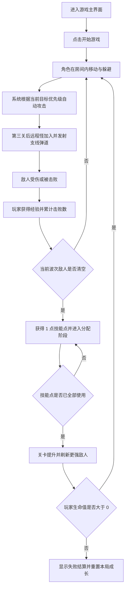

## 1. 产品概述
《像素地牢猎手》是一款桌面优先的单人像素风 roguelike 小游戏，玩家在扩展后的大尺寸地牢房间中持续移动、生存、自动攻击并推进关卡。
- 目标用户为希望快速体验轻量战斗循环的玩家，强调 3 到 5 分钟即可完成一局的爽快感。
- 产品价值在于用较小的功能范围构建一套完整可玩的玩法闭环，为后续扩展职业、道具、地图与敌人类型提供基础。

## 2. 核心功能

### 2.1 功能模块
1. **游戏主界面**：标题区、玩法提示、开始按钮、核心游戏画布、状态栏、结果提示。
2. **战斗场景模块**：玩家移动、敌人刷新、自动攻击、近战/远程敌人区分、受击反馈、拾取经验、关卡推进。
3. **成长加点模块**：每关结算后获得技能点，支持生命、攻击力、攻击速度与移动速度四项强化。
4. **结算与重开模块**：生命归零失败、通关阶段提示、重新开始当前局，并在新一局重置技能点与属性。

### 2.2 页面详情
| 页面名称 | 模块名称 | 功能描述 |
|-----------|-----------|-----------|
| 游戏主界面 | 头部信息区 | 展示游戏标题、风格说明、核心玩法提示与当前版本定位为 Demo。 |
| 游戏主界面 | 猎手状态条 | 固定在游戏画布顶部，展示生命、生命等级、攻击等级、攻速等级、移速等级与目标优先模式等基础属性。 |
| 游戏主界面 | 游戏画布 | 使用像素风网格地图展示地板、墙体装饰、玩家、敌人、投射物与特效。 |
| 游戏主界面 | 技能加点区 | 展示剩余技能点与四项属性加点按钮，仅在关卡完成后可分配。 |
| 游戏主界面 | 结果面板 | 在失败或阶段完成时展示摘要、继续/重开按钮与玩法反馈。 |

## 3. 核心流程
玩家进入页面后阅读玩法说明并开始游戏，角色在扩展后的地牢场景内通过 `WASD` 躲避敌人并靠近目标，系统自动朝当前优先目标类型中的最近敌人发射攻击；玩家可按 `Tab` 在最近近战怪与最近远程怪之间切换优先目标。第三关之后会刷新远程怪，远程怪会发射非锁定的扇形直线弹道，玩家需通过走位躲避；击败敌人后获得经验并推进波次，波次完成后进入关卡结算状态并获得 1 点技能点，只有在当前技能点全部使用完毕后才会进入下一关；若玩家生命值归零或重新开始，则技能点清零且角色属性回到初始值。

## 4. 用户界面设计
### 4.1 设计风格
- 主色为深墨绿、煤灰黑，辅色为琥珀黄与像素红，用于营造复古掌机与地牢火光氛围。
- 按钮采用硬边像素描边、块状阴影与按压位移反馈。
- 标题字体使用像素显示风格，正文字体使用清晰的无衬线字体，保证复古感与可读性平衡。
- 布局采用桌面优先的左信息右游戏区结构，核心画布居中展示。
- 图标与状态元素使用像素格块、心形生命图标、简单箭矢与爆闪粒子风格。

### 4.2 页面设计概览
| 页面名称 | 模块名称 | UI 元素 |
|-----------|-----------|----------|
| 游戏主界面 | 头部信息区 | 像素标题、版本标签、霓虹描边、副标题与淡入动画。 |
| 游戏主界面 | 猎手状态条 | 顶部横向状态卡、基础属性缩略文本、目标模式与像素边框。 |
| 游戏主界面 | 游戏画布 | 扩大四倍面积的 16x16 像素格地牢、地板纹理、边框噪点、角色帧动画、近战/远程敌人区分与弹道特效。 |
| 游戏主界面 | 技能加点区 | 四项强化按钮、当前加点等级、剩余点数提示与“用完后进入下一层”说明。 |
| 游戏主界面 | 结果面板 | 半透明遮罩、像素边框卡片、统计文本、重开按钮。 |

### 4.3 响应式
- 采用桌面优先设计，最佳体验宽度为 1280px 左右。
- 平板与移动端保留基本展示，但游戏画布按比例缩放，操作说明压缩到画布下方。
- 由于 Demo 以键盘操作为主，移动端仅保证信息可阅读，不作为首要触控优化目标。

## 5. 游戏玩法设计
### 5.1 核心循环
- 玩家进入房间后持续移动，利用更大的房间空间拉扯敌人并寻找安全走位。
- 自动攻击每隔固定时间朝当前优先类型中的最近敌人发射一枚投射物。
- 敌人接触玩家时造成伤害，玩家有短暂无敌时间避免瞬间暴毙。
- 第三关后新增远程怪，它们会释放非跟踪的扇形支线弹道，玩家需要预判路线躲避。
- 每一关包含固定数量敌人，清空后提升关卡并增强敌人的生命、移动速度与远程压制能力。
- 每通过一个关卡获得 1 点技能点，玩家必须在关卡间隙把当前技能点全部分配完，才能进入下一层。

### 5.2 角色与敌人规则
- 玩家初始生命值为 5，移动速度恒定，攻击频率较快但单次伤害较低。
- 基础近战敌人以追踪玩家为主，生命值低、数量逐关增加。
- 第三关后出现远程敌人，移动较慢但会周期性释放直线散射投射物。
- 玩家可按 `Tab` 切换自动攻击优先级，优先锁定最近近战怪或最近远程怪。
- 技能点可分配到生命、攻击力、攻击速度与移动速度，每次加点立即作用到当前角色面板。
- 游戏失败或手动重新开始时，技能点与所有加点效果清零，角色属性恢复初始值。
- 关卡提升时敌人刷新速度、最大数量和生命值同步上升，形成轻度 roguelike 压力曲线。

### 5.3 反馈机制
- 玩家与敌人受击时出现闪烁与像素碎片特效。
- 经验槽在击败敌人后增长，填满后立即触发本关完成或阶段强化提示。
- 游戏失败后展示存活关卡、击败数量与再次开始入口。

## 6. 基础素材方案
- **角色素材**：玩家使用 16x16 像素骑士/冒险者，包含待机两帧与移动两帧；近战敌人使用 16x16 史莱姆/骷髅，远程敌人使用 16x16 哥布林法师/炮手轮廓，包含施法一帧与受击一帧。
- **场景素材**：地板采用重复铺设的 16x16 石砖纹理，墙边使用深色描边方块与角落装饰；地牢火盆和裂纹可通过少量装饰 tile 组成。
- **特效素材**：玩家投射物使用 8x8 像素能量弹，远程怪弹道使用细长像素箭/魔法弹，命中特效使用 2 到 3 帧爆闪星形像素。
- **实现策略**：Demo 阶段优先使用 CSS + Canvas 绘制程序化像素图形，避免依赖外部美术文件；同时在代码中预留 spritesheet 替换入口，便于后续接入正式素材。
