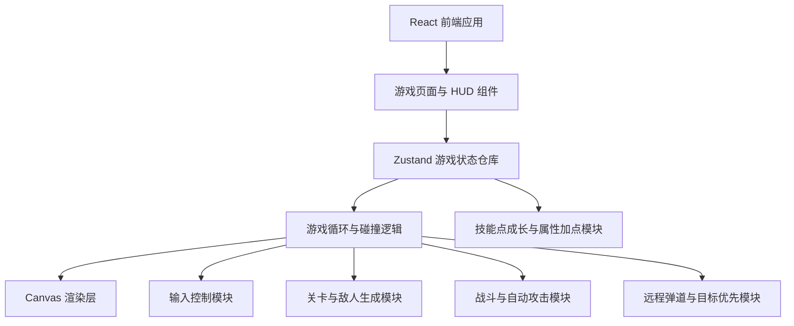

## 1. 架构设计


## 2. 技术描述
- 前端：React 18 + TypeScript + Vite + Tailwind CSS + Zustand
- 初始化工具：vite-init，模板选择 `react-ts`
- 后端：无，Demo 使用纯前端本地状态运行
- 数据：无数据库，关卡、敌人与配置采用本地 TypeScript 常量
- 测试：Vitest + React Testing Library，用于验证核心 UI 与关键状态逻辑

## 3. 路由定义
| 路由 | 用途 |
|------|------|
| / | 游戏唯一页面，承载玩法说明、顶部猎手状态条、技能加点区、Canvas 游戏区域与结果面板 |

## 4. 模块拆分
| 模块 | 位置建议 | 职责 |
|------|----------|------|
| 页面容器 | `src/pages/GamePage.tsx` | 组织整体布局、文案、玩法说明与主游戏组件 |
| 游戏舞台 | `src/components/game/GameCanvas.tsx` | 管理 Canvas 引用、渲染循环与像素场景绘制 |
| 顶部状态条 | `src/components/game/GameStatusBar.tsx` | 在画布顶部展示猎手基础属性和目标优先模式 |
| 技能面板 | `src/components/game/GameHud.tsx` | 展示关卡进度、技能点、加点按钮与层间提示 |
| 结果面板 | `src/components/game/GameOverlay.tsx` | 显示开始、关卡完成、失败与重新开始操作 |
| 状态仓库 | `src/store/useGameStore.ts` | 保存玩家、技能点、敌人、投射物、目标优先模式、关卡与流程状态 |
| 游戏逻辑 | `src/game/engine.ts` | 更新移动、生成近战/远程敌人、自动攻击、敌方散射弹道、碰撞、技能点门控与关卡推进 |
| 绘制工具 | `src/game/render.ts` | 用像素风几何图形绘制大地图、角色、近战/远程敌人与特效 |
| 配置常量 | `src/game/config.ts` | 地图尺寸、刷怪频率、远程怪数值、角色基础属性与技能成长规则 |

## 5. API 定义
- 本项目无独立后端 API。
- 所有游戏数据通过本地状态驱动，便于快速形成可运行 Demo。

## 6. 数据模型
### 6.1 类型定义
```ts
type Player = {
  hp: number;
  maxHp: number;
  speed: number;
  attackDamage: number;
  attackInterval: number;
};

type SkillAllocations = {
  vitality: number;
  power: number;
  haste: number;
  agility: number;
};

type GameState = {
  phase: "idle" | "running" | "level-clear" | "game-over";
  level: number;
  skillPoints: number;
  skillAllocations: SkillAllocations;
  targetPriority: "melee" | "ranged";
  player: Player;
  enemies: Enemy[];
  projectiles: Projectile[];
  enemyProjectiles: Projectile[];
};
```

### 6.2 数值与流程规则
- 地图扩大为原面积四倍，仍保留固定矩形房间和不可穿越边界。
- 玩家输入由键盘监听驱动，每帧根据按键状态更新位置。
- `Tab` 输入用于切换自动攻击优先级，需要在捕获阶段监听，避免被默认焦点切换抢占。
- 自动攻击逻辑以定时器或逐帧冷却实现，目标为当前优先类型中的最近敌人。
- 敌人生成规则由当前关卡配置决定，第三关后混入远程敌人。
- 远程敌人的攻击为非跟踪型散射直线弹道，发射瞬间瞄准玩家方向后保持直线飞行。
- 每次关卡肃清后给玩家增加 1 点技能点，并进入强制分配阶段。
- 只有在技能点全部使用完毕后，关卡完成计时器才会继续并进入下一层。
- 技能点效果只在当前局内生效，失败或重新开始时清零并恢复初始属性。
- 碰撞检测基于矩形或圆形近似，满足 Demo 简化实现。

## 7. 核心代码结构
```text
src/
  components/
    game/
      GameCanvas.tsx
      GameHud.tsx
      GameOverlay.tsx
      GameStatusBar.tsx
      PixelPanel.tsx
  game/
    config.ts
    engine.ts
    render.ts
    sprites.ts
    types.ts
  hooks/
    useGameLoop.ts
    useKeyboard.ts
  pages/
    GamePage.tsx
  store/
    useGameStore.ts
  utils/
    math.ts
    random.ts
```

## 8. 实现策略
- 使用单页结构承载游戏体验，减少路由复杂度，聚焦玩法完整性。
- 以 Canvas 进行核心场景渲染，结合 React 展示外层 UI、说明与结果面板。
- 使用 Zustand 管理游戏实体与流程状态，保证渲染层与逻辑层解耦。
- 战斗系统拆分为玩家投射物与敌方投射物两类，便于实现远程怪散射弹道与躲避逻辑。
- 属性成长通过技能点分配驱动，角色当前面板由基础属性和本局加点共同计算。
- 顶部猎手状态条只展示关键基础属性，左侧区域专注于技能点分配与关卡提示。
- 初始素材采用程序化像素绘制，若后续替换为外部图集，仅需修改 `sprites.ts` 与绘制逻辑。
- 优先实现稳定 60 FPS 附近的简化循环，避免引入不必要的物理引擎或后端依赖。

## 9. 2026-09-12 权威覆盖：首页／战斗资源加载门控

首页首次加载、从战斗返回首页及进入目标关卡时，必须先经过统一的资源 manifest、真实就绪进度和全屏过场门控。完整状态机、资源分域、缓存／重试语义、三图动画与验收标准统一以 [`../../docs/home-combat-loading-transition-v1.md`](../../docs/home-combat-loading-transition-v1.md) 为准。

- 资源加载器拥有 manifest、去重、缓存、重试和只读进度快照；React 过场只负责展示，不扫描 DOM 猜测依赖，也不重算关卡怪物或技能规则。
- 首页和战斗使用不同清单：首页覆盖首页功能模块；战斗清单由当前目标关卡与选中角色动态生成，不预加载其他关卡地图与怪物。
- 战斗状态机只在资源 `100%`、最低动画时长满足且过场 `0.4s` 淡出完成后启动一次；此前模拟 tick、计时、敌人和玩家输入全部保持未启动。
- 失败资源按权威退避规则无限异步重试，不得阻塞主线程或以 fallback 绕过门控。
